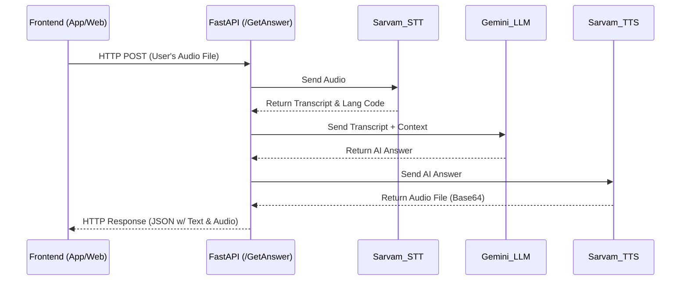

# Voice Assistant Backend Design Document

## 1. Overview
This document outlines the architecture and design of the Multilingual Voice Assistant backend API. The service provides a RESTful interface (`/GetAnswer`) that accepts a user's voice recording, processes it through a Speech-to-Text (STT) -> Large Language Model (LLM) -> Text-to-Speech (TTS) pipeline, and returns an audio response.

## 2. Architecture Diagram



## 3. Technology Stack
*   **Web Framework:** FastAPI (Python)
*   **Speech-to-Text (STT):** Sarvam AI (`saaras:v3`)
*   **Text-to-Speech (TTS):** Sarvam AI (`bulbul:v1`)
*   **Language Model (LLM):** Google Gemini 2.5 Flash

## 4. API Specification

### `POST /GetAnswer`
Accepts an audio file and returns the AI's spoken response.

**Request:**
*   **Content-Type:** `multipart/form-data`
*   **Body Parameters:**
    *   `audio_file`: The recorded audio file (e.g., `.wav`, `.mp3`) from the user's microphone.

**Response:**
*   **Content-Type:** `application/json`
*   **Body:**
```json
{
  "transcript": "Hello, what is VAPT?",
  "detected_language": "en-IN",
  "answer_text": "VAPT stands for Vulnerability Assessment and Penetration Testing.",
  "audio_base64": "UklGRiQAAABXQVZFZm10IBAAAAABAAEAQB8AAEAfAAABAAgAZGF0YQAAAAA..."
}
```

## 5. Design Decisions
*   **Headless API:** The backend does not implement any local microphone logic or wake word detection. The client application (Frontend) is responsible for capturing audio and detecting wake words to save bandwidth.
*   **Knowledge Base Integration:** The API loads `knowledge_base.json` into memory and uses it as RAG (Retrieval-Augmented Generation) context for Gemini to ensure deterministic answers to FAQs.
*   **Stateless File Handling:** Uploaded audio files are written to temporary system storage, processed, and deleted within the same request lifecycle to ensure zero data bloat on the server.
*   **Global Chat History (Demo):** Currently, chat history is held in a global list for demonstration. For production deployment, this will be keyed by a `session_id` provided in the HTTP request headers.
